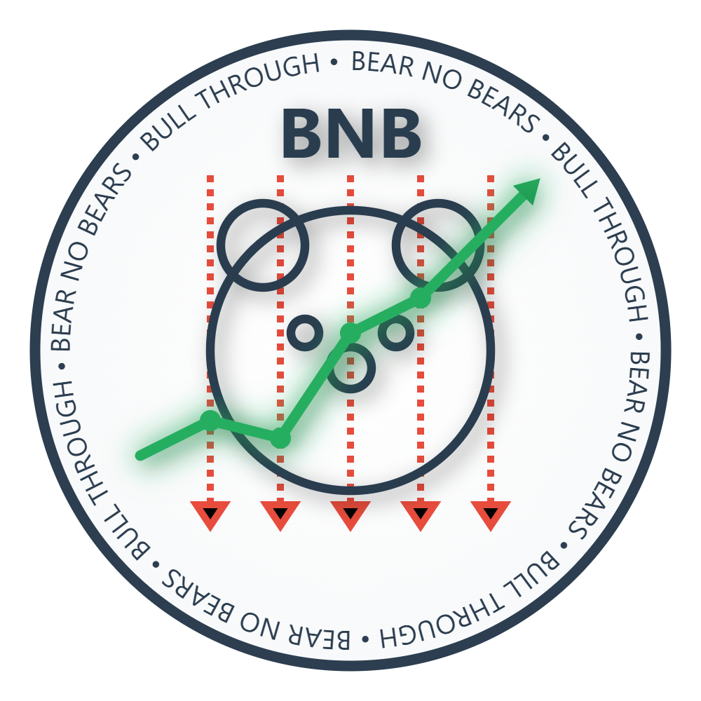

<p align="center">
  
</p>

# Bear No Bears - Portfolio Manager (BNB)

## Version 3.0 Release
Version 3.0 represents a significant evolution with enhanced portfolio analysis capabilities and improved data management:
- Advanced portfolio metrics calculation and storage
- Sophisticated visualisation tools for portfolio analysis
- Enhanced historical data management
- Improved transaction processing with FIFO/LIFO/HIFO support
- Better service architecture and code organisation
- Refined user interface with interactive charts

## Core Features

### Portfolio Management
- Create and manage multiple investment portfolios
- Import transactions from CSV/Excel files
- Track stocks across 60+ global exchanges (Any stock available on Yahoo Finance)
- Intelligent stock verification against Yahoo Finance
- Real-time price updates
- Comprehensive historical data tracking
- Advanced portfolio metrics calculation

### Transaction Handling
- Secure local SQLite database with optimized schema
- Support for buy/sell transactions
- Advanced dividend tracking and analysis
- Automated dividend reinvestment plan (DRP) calculations
- Sophisticated stock split management and verification
- FIFO/LIFO/HIFO calculation support for realised tax 
- Historical transaction analysis

### Portfolio Analysis
- Interactive portfolio performance visualisation
- Multiple chart types (line, area, pie charts)
- Profitability analysis (percentage and dollar values)
- Market value tracking
- Dividend performance analysis
- Portfolio distribution insights
- Custom date range analysis

### Market Support
- Built-in support for major international exchanges
- Intelligent market code handling
- Manual override options for data gaps
- Enhanced Yahoo Finance integration
- Improved historical data collection

## Technical Details

### Requirements
- Python 3.8 or higher
- PySide6 (Qt for Python)
- pandas
- yfinance
- matplotlib
- numpy

### Installation
```bash
# Clone the repository
git clone https://github.com/natstar99/BNB-Portfolio-Manager.git
cd BNB-Portfolio-Manager

# Install dependencies
pip install -r requirements.txt

# Run the application
python main.py
```

### Project Structure
```
BNB/
├── config.py                        # Core configuration settings
├── config.yaml                      # User configuration file
├── main.py                          # Application entry point
│
├── controllers/                              # Application logic controllers
│   ├── import_transactions_controller.py     # Handles importing of transaction data
│   ├── market_analysis_controller.py         # Controls market analysis features
│   ├── portfolio_controller.py               # Core portfolio operations controller
│   ├── portfolio_optimisation_controller.py  # Portfolio optimisation features
│   ├── portfolio_study_controller.py         # Controls portfolio analysis and visualisation
│   ├── portfolio_view_controller.py          # Manages portfolio view and interactions
│   └── portfolio_visualisation_controller.py # Manages portfolio view and interactions
│
├── database/                        # Database related files
│   ├── database_manager.py          # Core database operations manager
│   ├── portfolio_metrics.sql        # SQL for portfolio metrics calculations
│   ├── portfolio_metrics_manager.py # Manages portfolio metrics calculations
│   └── schema.sql                   # Main database schema
│
├── models/                          # Data models
│   ├── portfolio.py                 # Portfolio data model
│   ├── stock.py                     # Stock data model
│   └── transaction.py               # Transaction data model
│
├── utils/                           # Utility functions
│   ├── date_utils.py                # Date handling utilities
│   ├── fifo_hifo_lifo_calculator.py # Tax lot calculation utilities
│   ├── historical_data_collector.py # Historical data collection utilities
│   └── yahoo_finance_service.py     # Yahoo Finance API service wrapper
│
└── views/                           # User interface views
   ├── historical_data_view.py      # Historical data display view
   ├── import_transactions_view.py  # Transaction import interface
   ├── main_window.py              # Main application window
   ├── manage_markets_dialog.py     # Market settings management dialog
   ├── manage_portfolios_view.py    # Portfolio management interface
   ├── market_analysis_view.py      # Market analysis interface
   ├── my_portfolio_view.py         # Individual portfolio view
   ├── portfolio_optimisation_view.py # Portfolio optimisation interface
   ├── portfolio_study_view.py      # Portfolio analysis interface
   ├── portfolio_visualisation_view.py # Portfolio visualisation interface
   └── verify_transactions_view.py  # Transaction verification interface
```

## Current Status

### Working Features
- Portfolio creation and management
- Transaction import and verification
- International market support
- Stock split handling
- Dividend reinvestment tracking
- Historical data storage
- Basic portfolio analysis
- Yahoo Finance integration

### Future Development
V3.X will focus on:
- Improving the asset correlation matrices and risk analysis (Sharpe ratio, beta, etc.)
- Improving the portfolio optimisation features
- UI improvements
- Bug fixes and data fidelity
- Better support for different tax calculation methods
- Custom benchmark comparisons
- Tax optimisation strategies for realised profit/loss
V4.X+ will focus on:
- Initial .exe release with:
 - Automated updates
 - Installation wizard
 - User preferences persistence
- Machine learning/neural network integration:
 - Portfolio risk prediction
 - Market trend analysis
 - Anomaly detection
 - Price movement forecasting
 - Investment pattern recognition
- Market intelligence features:
 - Automated news aggregation and sentiment analysis
 - Real-time market trend detection
 - Company financial health monitoring
 - Sector performance analysis
 - Social media sentiment tracking
- Personal finance integratoin:
 - Budgeting and expense tracking
 - Net worth monitoring
 - Income and expense categorisation
 - Property portfolio tracking

### Known Limitations
- International currency conversion still in development
- Limited to Yahoo Finance data availability

## Contributing
BNB is an open-source project and welcomes contributions from the community. Whether you're fixing bugs, adding features, or improving documentation, your help is appreciated.

### How to Contribute
1. Fork the repository
2. Create a feature branch (`git checkout -b feature/AmazingFeature`)
3. Commit your changes (`git commit -m 'Add some AmazingFeature'`)
4. Push to the branch (`git push origin feature/AmazingFeature`)
5. Open a Pull Request


# Bear No License (BNL) v1.0

## In Normal Words

The logo belongs to me and you can not steal it because I really like it. The code I don't like as much, so you can take it - just give thanks. I would prefer if you did not make money off it (unless its like voluntary donations or something), because it's meant to be a free app for all the people to use. But if you have made a significant development, and wish to take the code off on your own path and under your own name and license, I don't want to restrict that either - so in that case, just let me know first, and then it'll be sweet.

## In Lawyer Words

Copyright (c) 2024 Bear No Bears

### Definitions

- "Software" refers to the Bear No Bears Portfolio Manager application code and associated documentation
- "Logo" refers to the Bear No Bears logo, the name "Bear No Bears", and all associated branding materials
- "Original Author" refers to the creator of Bear No Bears
- "Derivative Work" refers to any modified version of the Software
- "Significant Development" refers to substantial modifications or enhancements that materially change the Software's functionality or purpose

### Logo Rights

The Logo (including the name "Bear No Bears") is protected by copyright and trademark law. Use of the Logo is permitted only for the purpose of attribution and acknowledging the Original Author ("giving thanks"). Any other use including, but not limited to, commercial use, modification, merging, publishing, distribution, sublicensing, and/or selling copies of the Logo, or using the name "Bear No Bears" as part of another project's branding, requires explicit written permission from the Original Author.

### Software License Terms

Permission is hereby granted, free of charge, to any person obtaining a copy of the Software, to deal in the Software with the following restrictions:

1. **Attribution Requirements**
   - All copies or substantial portions of the Software must include appropriate attribution ("giving thanks") to the Original Author

2. **Commercial Use**
   - Non-commercial use is freely permitted
   - Voluntary donations for non-commercial use are permitted without notification
   - Commercial use or monetisation of the Software or Derivative Works requires prior written notification to the Original Author
   - The Original Author reserves the right to review and approve commercial applications

3. **Warranty and Liability**
   - The Software is provided "AS IS", without warranty of any kind, express or implied
   - In no event shall the Original Author be liable for any claim, damages or other liability arising from the use of the Software

4. **Notification Requirements**
   - Written notifications required under this license shall be sent to the Original Author via the project's official communication channels
   - Notifications must include detailed information about:
     - Intended commercial use or monetisation plans
     - Description of Significant Development for relicensing purposes
     - Proposed new license for Derivative Works

### Additional Terms

1. This license applies only to the Software and not to the Logo or other trademarked materials
2. The Original Author reserves the right to modify this license for future versions of the Software
3. Failure to comply with the terms of this license automatically terminates your rights under this license

---

END OF TERMS AND CONDITIONS


## Acknowledgements
- Yahoo Finance for market data
- Qt/PySide6 for the user interface framework
- Community contributors and testers

---